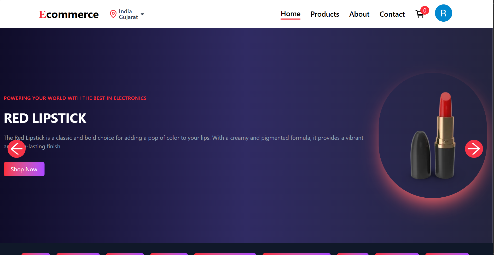
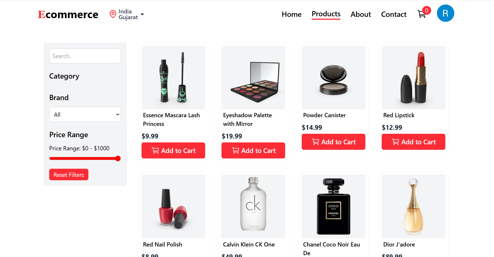
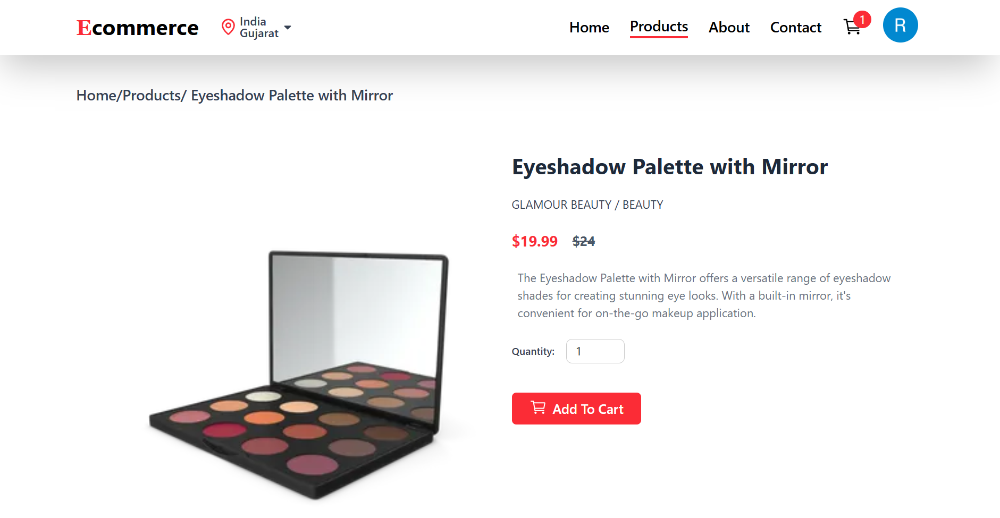
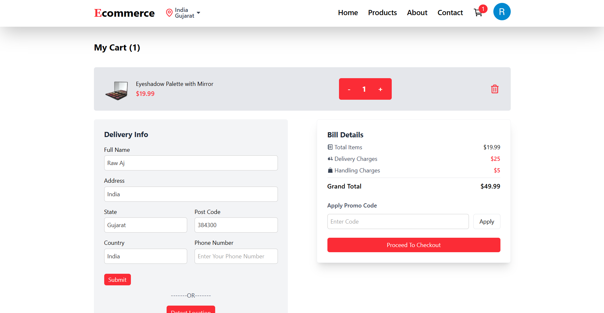
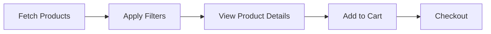

# 🌌 **ECommerce Website – Modern React + Clerk Authentication + TailwindCSS**

A high-performance, fully authenticated **E-Commerce Platform** built with **React 18**, **TailwindCSS**, **Clerk Authentication**, **Context API**, and **DummyJSON API**. This project is designed to showcase a modern, responsive, and secure e-commerce experience.

## 📑 **Table of Contents**

1. [✨ Features](#features)
2. [📸 Screenshots](#screenshots)
3. [🎥 Demo Video](#demo-video)
4. [🧩 Tech Stack](#tech-stack)
5. [📁 Folder Structure](#folder-structure)
6. [⚙️ Installation](#installation)
7. [🔑 Environment Variables](#environment-variables)
8. [🔌 API Usage](#api-usage)
9. [🛍 Product Flow](#product-flow)
10. [🛡 Authentication (Clerk)](#authentication-clerk)
11. [🛒 Cart System](#cart-system)
12. [🙏 Acknowledgments](#acknowledgments)

---

## ✨ **Features**

### 🚀 **Core Features**

- **Ultra-fast React 18 SPA Architecture**
- **Advanced product filters** (Brand / Category / Price / Search)
- **Fully responsive dark-theme UI**
- **Realtime Clerk Authentication**
- **Smart Cart** (Add, Remove, Quantity, LocalStorage Sync)

### 🎨 **UI/UX**

- **Dynamic product pages** w/ SEO-friendly routing
- **Auto Location** (Reverse Geocoding via OpenStreetMap)
- **TailwindCSS + Neon-glow animations**
- **Toast Notifications + Scroll Restoration**

### 🔐 **Security**

- **Protected Routes**
- **Session Management via Clerk**

---

## 📸 **Screenshots**

### 🏠 **Home Page**



### 🛍 **Products Page**



### 📄 **Single Product Page**



### 🛒 **Cart Page**



---

## 🎥 **Demo Video**

🎬 **Demo Video:** ➡️ [Watch Demo](https://drive.google.com/file/d/1MjbIEEFoW7JV-fmMhgWfSJu_wactIC2p/view?usp=drivesdk)

---

## 🧩 **Tech Stack**

### 💻 **Frontend**

- **React 18**
- **React Router v6**
- **Tailwind CSS** (Dark Neon theme)
- **Axios**
- **Lottie Files**
- **react-toastify**
- **react-scroll-to-top**

### 🔐 **Authentication**

- **Clerk React SDK**

### 🛒 **State Management**

- **Context API**
- **LocalStorage Persistence**

### 🌍 **APIs Used**

- **DummyJSON API** (Products)
- **OpenStreetMap Reverse Geo API**

---

## 📁 **Folder Structure**

```
src/
│── App.jsx
│── index.jsx
│
├── Pages/
│   ├── Home.jsx
│   ├── Products.jsx
│   ├── SingleProduct.jsx
│   ├── CategoryProduct.jsx
│   ├── Contact.jsx
│   ├── About.jsx
│   └── Cart.jsx
│
├── Components/
│   ├── Navbar.jsx
│   ├── Footer.jsx
│   ├── ProductCard.jsx
│   ├── Carousel.jsx
│   ├── MidBanner.jsx
│   ├── Features.jsx
│   ├── FilterSection.jsx
│   ├── MobileFilter.jsx
│   └── ProtectedRoute.jsx
│
├── Context/
│   ├── DataContext.jsx
│   └── CartContext.jsx
│
└── assets/
    ├── Loading.webm
    ├── notfound.json
    └── images...
```

---

## ⚙️ **Installation**

### 📦 **Step-by-Step Setup**

```bash
# 1️⃣ Clone repository
git clone https://github.com/parmarajay2712/Ecommerce-Website.git

# 2️⃣ Navigate to project directory
cd your-repo

# 3️⃣ Install dependencies
npm install

# 4️⃣ Run development server
npm run dev
```

---

## 🔑 **Environment Variables**

Create a `.env` file in the root directory:

```env
VITE_CLERK_PUBLISHABLE_KEY=your_clerk_key_here
```

### 🔗 **Get Your Clerk Key**

1. Sign up at [Clerk.dev](https://clerk.dev)
2. Create a new application
3. Copy your **Publishable Key**
4. Paste it into `.env`

---

## 🔌 **API Usage**

### 📦 **DummyJSON Products API**

```javascript
// Fetch all products
GET https://dummyjson.com/products

// Fetch single product
GET https://dummyjson.com/products/:id
```

### 🌍 **Reverse Geo-Location API**

```javascript
// Get location from coordinates
GET https://nominatim.openstreetmap.org/reverse?lat={lat}&lon={lon}&format=json
```

---

## 🛍 **Product Flow**



### ✅ **Flow Steps**

1. ✔ Fetch All Products from API
2. ✔ Apply Filters (Brand, Category, Price, Search)
3. ✔ View Single Product Details
4. ✔ Add to Cart
5. ✔ Persistent State via LocalStorage

---

## 🛡 **Authentication (Clerk)**

### 🔐 **Features**

- **Login required** for Cart access
- **Global session management**
- **ProtectedRoute** redirects if unauthenticated
- **Smooth Clerk UI** integration

### 🔧 **Implementation**

```jsx
import { SignIn, SignUp, useUser } from "@clerk/clerk-react";

// Protected Route Component
const ProtectedRoute = ({ children }) => {
  const { isSignedIn } = useUser();
  return isSignedIn ? children : <Navigate to="/sign-in" />;
};
```

---

## 🛒 **Cart System**

### ✨ **Features**

- ➕ **Add / Remove Products**
- 🔢 **Update Quantity**
- 💾 **Auto-save to LocalStorage**
- ♻️ **Persistent after refresh**
- 🔒 **Protected Checkout Route**

### 🛠 **Cart Context Example**

```jsx
const CartContext = createContext();

export const CartProvider = ({ children }) => {
  const [cart, setCart] = useState([]);
  
  const addToCart = (product) => {
    setCart([...cart, product]);
    localStorage.setItem('cart', JSON.stringify(cart));
  };
  
  return (
    <CartContext.Provider value={{ cart, addToCart }}>
      {children}
    </CartContext.Provider>
  );
};
```

---

## 🙏 **Acknowledgments**

- [**DummyJSON**](https://dummyjson.com) — Product API
- [**Clerk**](https://clerk.dev) — Authentication
- [**OpenStreetMap**](https://openstreetmap.org) — Location API
- **React + Tailwind + Vite Ecosystem**

---

## 📝 **License**

MIT License — free to use, modify, and distribute.

---

## 👨‍💻 **Author**

**Parmar Ajay**
Frontend Developer | Loves building beautiful UI, clean code editors, and learning new technologies.**

- **Email:** [parmarajay5664@gmail.com@gmail.com](parmarajay5664@gmail.com)
- **LinkedIn:** [Parmar Ajay](https://www.linkedin.com/in/parmar-ajay2712/)

---

<div align="center">
  <strong>⭐ If you like this project, give it a star! ⭐</strong>
</div>
